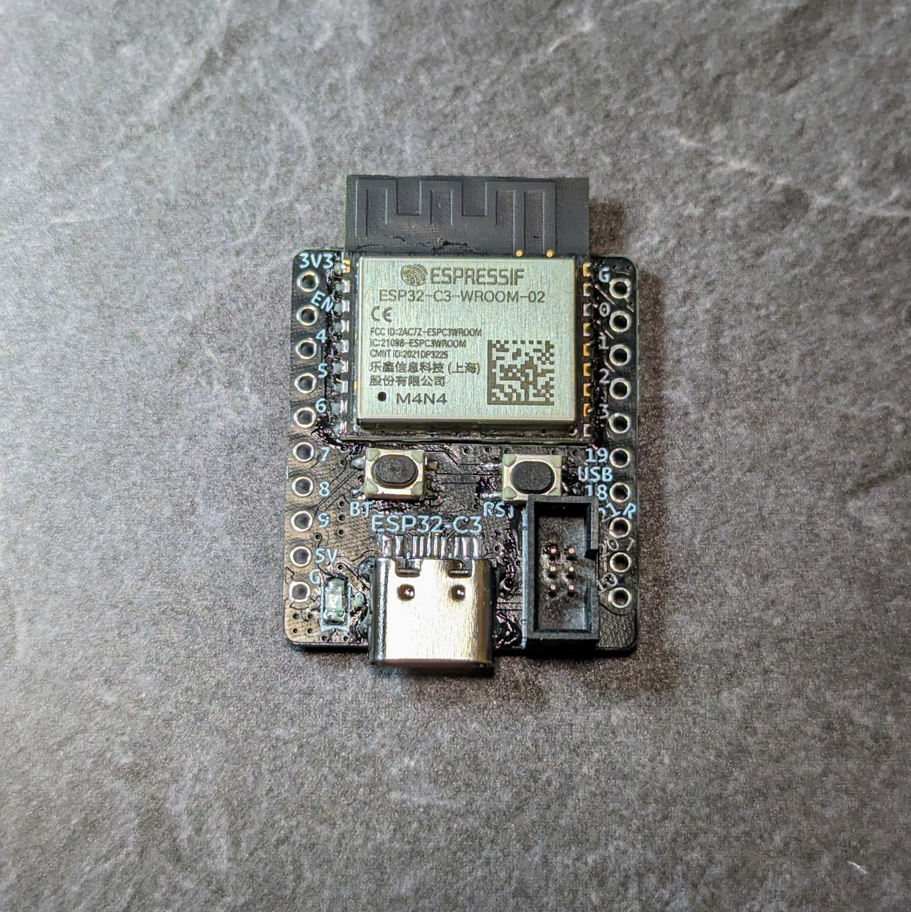
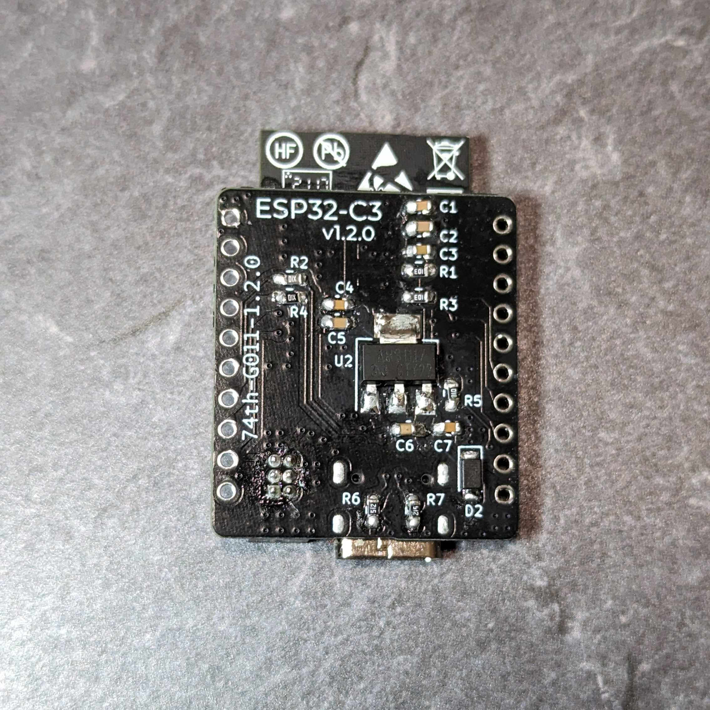
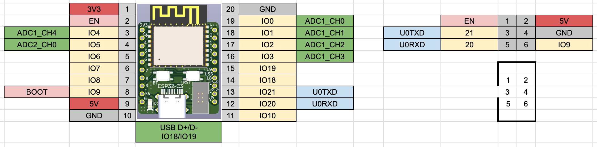
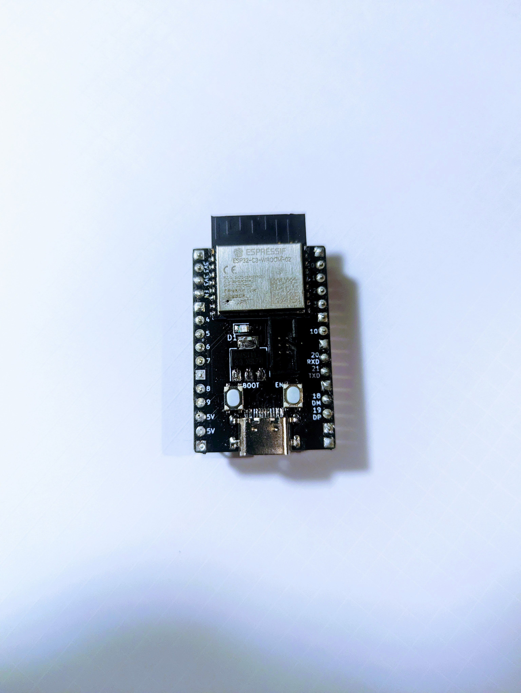

# ESP32-C3 Dev Board

ESP32-C3-WROOM-02 を使った開発ボード

- 10 ピンブレッドボードに挿しても、左右 1 ピン空いている
- ESP-Prog の USB シリアル変換のボックスピンヘッダを持つ
- USB Type-C をもつ

BOOTH でモジュール付きキットを販売中です。 
https://74th.booth.pm/items/4378573

## v1.2.0

### 変更点

- USB DM/DP にダンピング抵抗を追加
- 電源にダイオードを追加
- ESP-C3-DevKitC-02 互換の配置を止めた

### ピンマップ

### ドキュメント

- 回路図 [pdf](esp32c3devboard-1.2.0-semantics.pdf) [kicanvas](https://kicanvas.org/?github=https%3A%2F%2Fgithub.com%2F74th%2Fesp32-dev-boards%2Fblob%2Fesp3s-c3-devboard%2Fv1.2.0%2FESP32-C3-WROOM-02%2FESP32-C3-WROOM-02.kicad_sch)
- PCB [pdf](esp32c3devboard-1.2.0-pcb.pdf) [kicanvas](https://kicanvas.org/?github=https%3A%2F%2Fgithub.com%2F74th%2Fesp32-dev-boards%2Fblob%2Fesp3s-c3-devboard%2Fv1.2.0%2FESP32-C3-WROOM-02%2FESP32-C3-WROOM-02.kicad_pcb)

### 部品表

| Reference | Name                                           | Quantity |
| --------- | ---------------------------------------------- | -------- |
| C1,C4,C7  | Capacitor 0603 100nF                           | 3        |
| C2,C5,C6  | Capacitor 0603 10uF                            | 3        |
| C3        | Capacitor 0603 1uF                             | 1        |
| D1        | LED 0805 LED                                   | 1        |
| D2        | Schottky barrier diode SOD-123W PMEG2010ER,115 | 1        |
| J1        | Box Pin Header 2x3 Pitch 1.27mm                | 1        |
| J2        | USB Type-C Receptacle                          | 1        |
| R1,R3     | Register 0603 10kΩ                             | 2        |
| R2,R4     | Register 0603 10Ω                              | 2        |
| R5        | Register 0603 1kΩ                              | 1        |
| R6,R7     | Register 0603 5.1kΩ                            | 2        |
| SW1,SW2   | Button SKRPABE010                              | 2        |
| U1        | WiFi MCU Module ESP32-C3-WROOM-02              | 1        |
| U2        | Regulator 3.3V SOT-223 AMS1117-3.3             | 1        |

## v1.1.0

- 回路図 [pdf](esp32c3devboard-1.1.0-semantics.pdf) [kicanvas](https://kicanvas.org/?github=https%3A%2F%2Fgithub.com%2F74th%2Fesp32-dev-boards%2Fblob%2Fesp3s-c3-devboard%2Fv1.1.0%2FESP32-C3-WROOM-02%2FESP32-C3-WROOM-02.kicad_sch)
- PCB [pdf](esp32c3devboard-1.1.0-pcb.pdf) [kicanvas](https://kicanvas.org/?github=https%3A%2F%2Fgithub.com%2F74th%2Fesp32-dev-boards%2Fblob%2Fesp3s-c3-devboard%2Fv1.1.0%2FESP32-C3-WROOM-02%2FESP32-C3-WROOM-02.kicad_pcb)

### 部品表

| 指定子    | 名称                                      | 数量 |
| --------- | ----------------------------------------- | ---- |
| R1        | 0805 レジスタ 1k                          | 1    |
| R2,R5     | 0805 レジスタ 10k                         | 2    |
| R3,R4     | 0805 レジスタ 5.1k                        | 2    |
| C1,C4,C6  | 0805 キャパシタ 10u                       | 3    |
| C2,C3,C7  | 0805 キャパシタ 100n                      | 3    |
| C5        | 0805 キャパシタ 1u                        | 1    |
| D1        | 0805 LED                                  | 1    |
| J3        | UART ボックスピンヘッダ 2.3 1.27mm ピッチ | 1    |
| J4        | USB 2.0 Type-C ミッドマウントソケット     | 1    |
| U1        | 3.3V レギュレータ AMS1117-3.3             | 1    |
| U2        | ESP32-C3-WROOM-02                         | 1    |
| SW1(EN)   | プッシュスイッチ SKRPABE010(EN)           | 1    |
| SW1(BOOT) | プッシュスイッチ SKRPABE010(BOOT)         | 1    |

- ESP32-C3-WROOM-02 は非常に熱に弱いモジュールです。ボード裏面にはサーマルパッドをはんだづけするための穴が空いていますが、熱を与えすぎに注意してください。BOOTH のキットでは熱伝導テープを添付しています。カットして、モジュールに貼り付けて、青いテープ、透明テープを剥がして利用ください。モジュールが浮きすぎないように押さえつけて利用ください。
