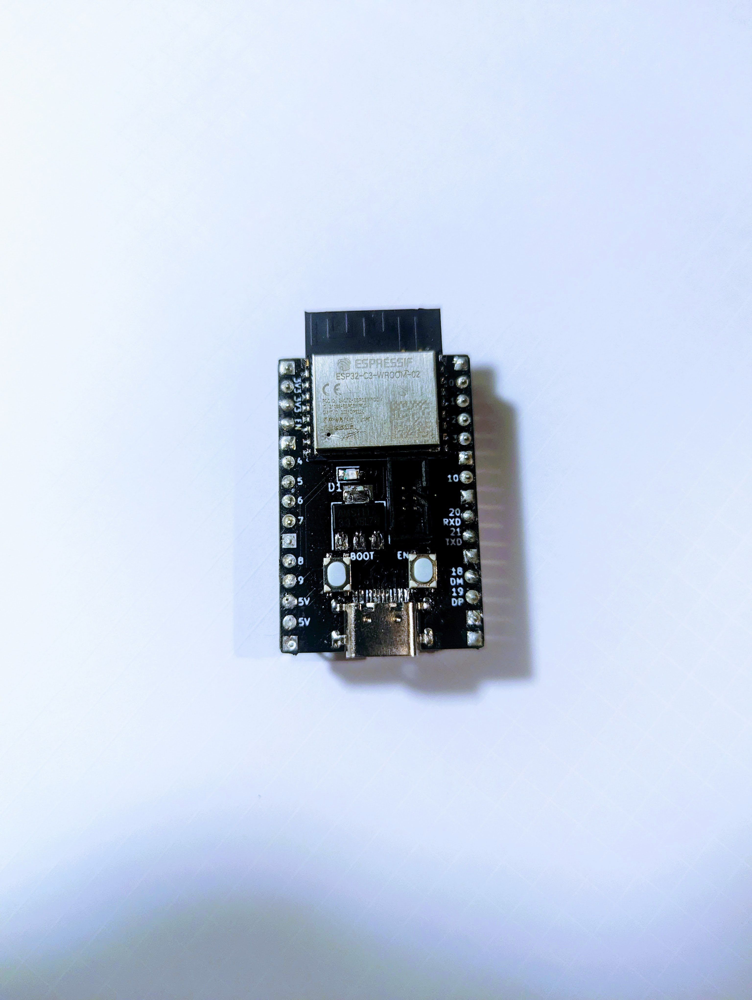
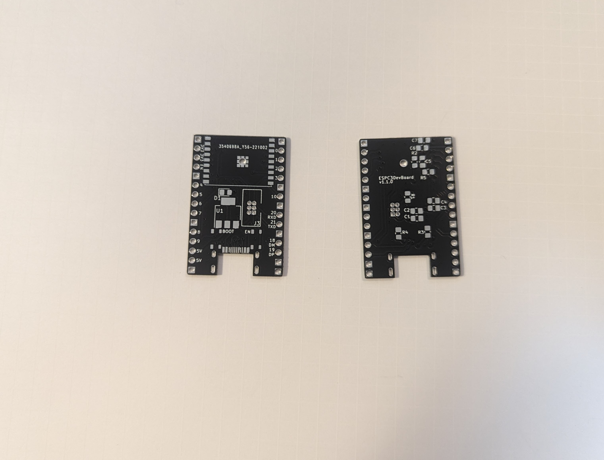

# ESP32-C3 Dev Board

ESP32-C3-WROOM-02 を使った開発ボード

- ピンヘッダは ESP-C3-DevKitC-02 互換の配置
- 10 ピンブレッドボードに挿しても、左右 1 ピン空いている
- ESP-Prog の USB シリアル変換のボックスピンヘッダを持つ
- USB Type-C をもつ

## v1.1.0

### 部品表

| 指定子    | 名称                                      | 数量 |
| --------- | ----------------------------------------- | ---- |
| R1        | 0805 レジスタ 1k                          | 1    |
| R2,R5     | 0805 レジスタ 10k                         | 2    |
| R3,R4     | 0805 レジスタ 5.1k                        | 2    |
| C1,C4,C6  | 0805 キャパシタ 10u                       | 3    |
| C2,C3,C7  | 0805 キャパシタ 100n                      | 3    |
| C5        | 0805 キャパシタ 1u                        | 1    |
| D1        | 0805 LED                                  | 1    |
| J3        | UART ボックスピンヘッダ 2.3 1.27mm ピッチ | 1    |
| J4        | USB 2.0 Type-C ミッドマウントソケット     | 1    |
| U1        | 3.3V レギュレータ AMS1117-3.3             | 1    |
| U2        | ESP32-C3-WROOM-02                         | 1    |
| SW1(EN)   | プッシュスイッチ SKRPABE010(EN)           | 1    |
| SW1(BOOT) | プッシュスイッチ SKRPABE010(BOOT)         | 1    |

## ドキュメント

- [回路図 ./esp32c3devboard-1.1.0-semantics.pdf](esp32c3devboard-1.1.0-semantics.pdf)
- [PCB ./esp32c3devboard-1.1.0-pcb.pdf](esp32c3devboard-1.1.0-pcb.pdf)
