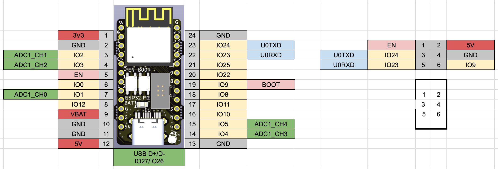

# ESP32-C6-WROOM-1 Dev Board

ESP32-C6-WROOM-1 を使った開発ボード

- 10 ピンブレッドボードに挿しても、左右 1 ピン空いている
- ESP-Prog の USB シリアル変換のボックスピンヘッダを持つ
- USB Type-C をもつ

BOOTH でモジュール付きキットを販売中です。 
https://74th.booth.pm/items/5777580

  

## v1.0.0

- 回路図 [pdf](./ESP32-C6-WROOM-1_v1.0.0_semantics.pdf) [kicanvas](https://kicanvas.org/?github=https%3A%2F%2Fgithub.com%2F74th%2Fesp32-dev-boards%2Fblob%2Fesp32-c6-wroom-1%2Fv1.0.0%2FESP32-C6-WROOM-1%2FESP32-C6-WROOM-1.kicad_sch)
- PCB [kicanvas](https://kicanvas.org/?github=https%3A%2F%2Fgithub.com%2F74th%2Fesp32-dev-boards%2Fblob%2Fesp32-c6-wroom-1%2Fv1.0.0%2FESP32-C6-WROOM-1%2FESP32-C6-WROOM-1.kicad_pcb)

### BOM

| Reference   | Name                                           | Quantity |
| ----------- | ---------------------------------------------- | -------- |
| C1          | Capacitor 0805 22uF                            | 1        |
| C2,C3       | Capacitor 0805 10uF                            | 2        |
| C4          | Capacitor 0805 1uF                             | 1        |
| D1          | Schottky barrier diode SOD-123W PMEG2010ER,115 | 1        |
| D2          | LED 0805 Blue                                  | 1        |
| J1          | Box Pin Header 2x3 Pitch 1.27mm                | 1        |
| J2          | USB Type-C Receptacle                          | 1        |
| R1,R6,R7,R8 | Register 0805 10kΩ                             | 4        |
| R2,R3       | Register 0805 10Ω                              | 2        |
| R4,R5       | Register 0805 5.1kΩ                            | 2        |
| SW1,SW2     | Button SKRPABE010                              | 2        |
| U1          | WiFi MCU Module ESP32-C6-WROOM-1               | 1        |
| U2          | Regulator 3.3V SOT-223 AMS1117-3.3             | 1        |

## ピンマップ

