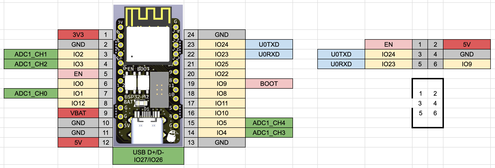

# ESP32-H2-MINI-1 DevBoard

ESP32-H2-MINI-1 を使った開発ボード

BoxPinHeader は ESP-Prog の UART と接続できます。

## v1.0.1

- Semantics [pdf](./ESP32-H2-MINI-1-basic_v1.0.1_semantics.pdf) [kicanvas](https://kicanvas.org/?github=https%3A%2F%2Fgithub.com%2F74th%2Fesp32-dev-boards%2Fblob%2Fesp32-h2-mini-1-basic%2Fv1.0.1%2FESP32-H2-MINI-1%2Fbasic%2FESP32-H2-MINI-1-basic.kicad_sch)
- PCB [kicanvas](https://kicanvas.org/?github=https%3A%2F%2Fgithub.com%2F74th%2Fesp32-dev-boards%2Fblob%2Fesp32-h2-mini-1-basic%2Fv1.0.1%2FESP32-H2-MINI-1%2Fbasic%2FESP32-H2-MINI-1-basic.kicad_pcb)

### 部品表

| Reference   | Name                                           | Quantity |
| ----------- | ---------------------------------------------- | -------- |
| C1,C6,C8,C9 | Capacitor 0603 10uF                            | 4        |
| C2,C7       | Capacitor 0603 0.1uF                           | 2        |
| C3          | Capacitor 0603 1uF                             | 1        |
| C4,C5       | Capacitor 0603 10pF                            | 2        |
| D1          | LED 0805 Blue                                  | 1        |
| D2          | Schottky barrier diode SOD-123W PMEG2010ER,115 | 1        |
| J1          | Box Pin Header 2x3 Pitch 1.27mm                | 1        |
| J2          | USB Type-C Receptacle                          | 1        |
| R1,R2       | Register 0603 10Ω                              | 2        |
| R3,R4,R5,R6 | Register 0603 10kΩ                             | 4        |
| R7,R8       | Register 0603 5.1kΩ                            | 2        |
| SW1,SW2     | Button SKRPABE010                              | 2        |
| U1          | WiFi MCU Module ESP32-H2-MINI-1                | 1        |
| U2          | Regulator 3.3V SOT-89 AMS1117-3.3              | 1        |
| Y1          | Crystal 3215 32kHz                             | 1        |

### ピンマップ

## v1.0.0

- Semantics [pdf](./ESP32-H2-MINI-1-basic_v1.0.0_semantics.pdf) [kicanvas](https://kicanvas.org/?github=https%3A%2F%2Fgithub.com%2F74th%2Fesp32-dev-boards%2Fblob%2Fesp32-h2-mini-1-basic%2Fv1.0.0%2FESP32-H2-MINI-1%2Fbasic%2FESP32-H2-MINI-1-basic.kicad_sch)
- PCB [kicanvas](https://kicanvas.org/?github=https%3A%2F%2Fgithub.com%2F74th%2Fesp32-dev-boards%2Fblob%2Fesp32-h2-mini-1-basic%2Fv1.0.0%2FESP32-H2-MINI-1%2Fbasic%2FESP32-H2-MINI-1-basic.kicad_pcb)

### 部品表

| Reference   | Name                                           | Quantity |
| ----------- | ---------------------------------------------- | -------- |
| C1,C6,C8,C9 | Capacitor 0603 10uF                            | 4        |
| C2,C7       | Capacitor 0603 0.1uF                           | 2        |
| C3          | Capacitor 0603 1uF                             | 1        |
| C4,C5       | Capacitor 0603 10pF                            | 2        |
| D1          | LED 0805 Blue                                  | 1        |
| D2          | Schottky barrier diode SOD-123W PMEG2010ER,115 | 1        |
| J1          | Box Pin Header 2x3 Pitch 1.27mm                | 1        |
| J2          | USB Type-C Receptacle                          | 1        |
| R1,R2       | Register 0603 10Ω                              | 2        |
| R3,R4,R5,R6 | Register 0603 10kΩ                             | 4        |
| R7,R8       | Register 0603 5.1kΩ                            | 2        |
| SW1,SW2     | Button SKRPABE010                              | 2        |
| U1          | WiFi MCU Module ESP32-H2-MINI-1                | 1        |
| U2          | Regulator 3.3V SOT-89 AMS1117-3.3              | 1        |
| Y1          | Crystal 2012 32kHz                             | 1        |

### ピンマップ

