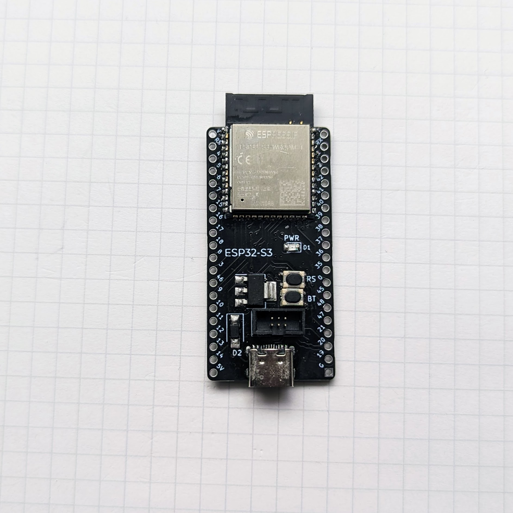
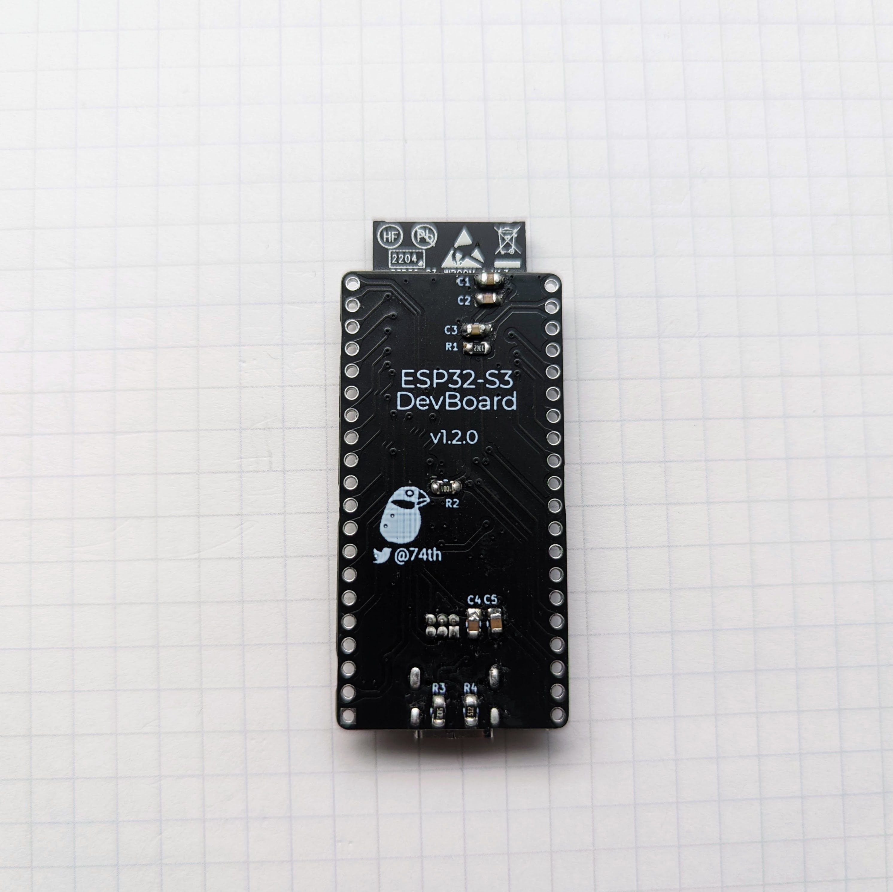
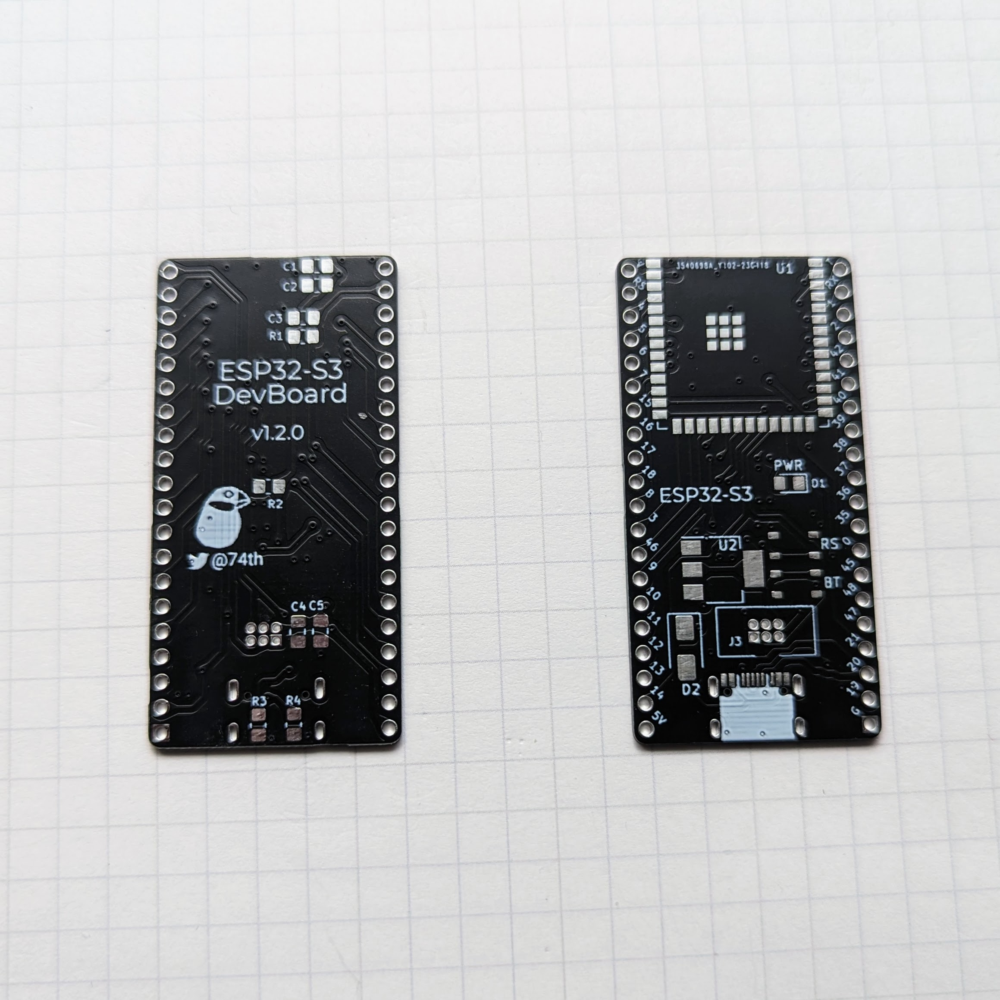
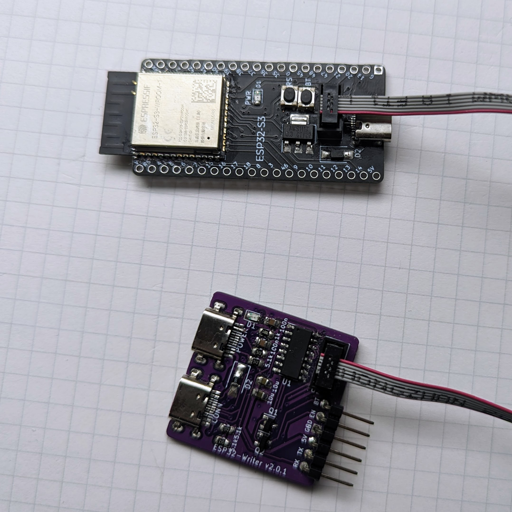

# ESP32-S3 Dev Board

ESP32-S3-WROOM-1 を使った開発ボード。

- ピンヘッダは ESP32-S3-DevKitC 互換の配置
- 10 ピンブレッドボードに挿しても、左右 1 ピン空いている
- ESP-Prog の USB シリアル変換のボックスピンヘッダを持つ
- USB Type-C を持つ

BOOTH でモジュール付きキットを販売中です 
https://74th.booth.pm/items/4179263

## なぜ、公式の ESP32-S3-DevKitC を使わず、これを必要になるか

- 10 ピンブレッドボードに刺すと、片方使えなくなるから。
- MicroUSB ではなく USB Type-C で使いたいから。
- USB シリアル変換 IC が別になっている方が、ボード単体で使う時に消費電力が下がるから。

## v1.2.0

ピンヘッダのアサインは ESP32-S3-DevKitC v1.1 互換のため、こちらを確認下さい。

https://docs.espressif.com/projects/esp-idf/en/v4.4.2/esp32s3/hw-reference/esp32s3/user-guide-devkitc-1.html#header-block

- [semantics 回路図](ESP32-S3-WROOM-1-v1.2.0-semantics.pdf)
- [pcb](ESP32-S3-WROOM-1-v1.2.0-pcb.pdf)

### parts list 部品表

| id       | parts name                              | number |
| -------- | --------------------------------------- | ------ |
| J4       | USB 2.0 Type-C Socket                   | 1      |
| R1       | 0805 Register 10k                       | 1      |
| R2       | 0805 Register 1k                        | 1      |
| R3,R4    | 0805 Register 5.1k                      | 2      |
| C1,C5    | 0805 Capacitor 10u                      | 2      |
| C2,C4    | 0805 Capacitor 100n                     | 2      |
| C3       | 0805 Capacitor 1u                       | 1      |
| D1       | 0805 LED Blue                           | 1      |
| U2       | SOT-223 3.3V Regulator AMS1117-3.3      | 1      |
| D2       | SMA Schottky Barrier Diode SR240        | 1      |
| U1       | ESP32-S3-WROOM-1                        | 1      |
| SW1, SW2 | SKRPABE010 Compatible push button       | 2      |
| J3       | ESP-Prog UART Compatible Box Pin Header | 1      |

## v1.1.1

ピンヘッダのアサインは ESP32-S3-DevKitC v1.1 互換のため、こちらを確認下さい。

https://docs.espressif.com/projects/esp-idf/en/v4.4.2/esp32s3/hw-reference/esp32s3/user-guide-devkitc-1.html#header-block

- [semantics 回路図](ESP32-S3-WROOM-1-v1.1.1-semantics.pdf)
- [pcb](ESP32-S3-WROOM-1-v1.1.1-pcb.pdf)

### 部品表

| 指定子   | パッケージ                                            | 数量 |
| -------- | ----------------------------------------------------- | ---- |
| R2,R1    | 0805 レジスタ 5.1kR                                   | 2    |
| R3       | 0805 レジスタ 1kR                                     | 1    |
| R4       | 0805 レジスタ 10kR                                    | 1    |
| C2       | 0805 キャパシタ 1uF                                   | 1    |
| C1,C3,C5 | 0805 キャパシタ 10uF                                  | 3    |
| C4,C6    | 0805 キャパシタ 100nF                                 | 2    |
| D1       | DNP（実装不要）                                       | 1    |
| D2       | 0805 LED(D-)                                          | 1    |
| D3       | 0805 LED(D+)                                          | 1    |
| D5       | 0805 LED(PWR)                                         | 1    |
| D4       | 1A40V ショットキーダイオード 1N5819(0805 レジスタ 0R) | 1    |
| U2       | 3.3v レギュレータ AMS1117-3.3                         | 1    |
| J3       | UART 1.27mm ボックスピンヘッダ 2x3                    | 1    |
| J4       | USB 2.0 Type-C ソケット                               | 1    |
| U1       | ESP32-S3-WROOM-1                                      | 1    |
| SW1      | SKRPABE010(BOOT)                                      | 1    |
| SW2      | SKRPABE010(EN)                                        | 1    |

- D4 には、USB からの電源供給の場合、レジスタ 0R をセットします。booth で販売のセットには 0805 レジスタ 0R を付属しています。
- D1 は、電源表示 LED ですが v1.1.1 では抵抗を入れ忘れているため、実装なしとしてください。
- R3 は、D5 の保護抵抗ですが、使用する LED によっては 1kR が大きすぎる場合がありますので、その場合は少し小さい値に変更して下さい。
- ESP32-S3-WROOM-1 にはサーマルパッドがありますが、BOOTH のキットでは熱伝導テープを添付しています。カットして、モジュールに貼り付けて、青いテープ、透明テープを剥がして利用ください。モジュールが浮きすぎないように押さえつけて利用ください。（初期販売物には、添付しておりませんでした。ご容赦ください。）。

[部品の調達先はこちらを確認下さい ../parts.md](../parts.md)

### ドキュメント

- [Semantics ESP32-S3-WROOM-1-v1.1.1-semantics.pdf](ESP32-S3-WROOM-1-v1.1.1-semantics.pdf)
- [PCB ESP32-S3-WROOM-1-v1.1.1-pcb.pdf](ESP32-S3-WROOM-1-v1.1.1-pcb.pdf)
