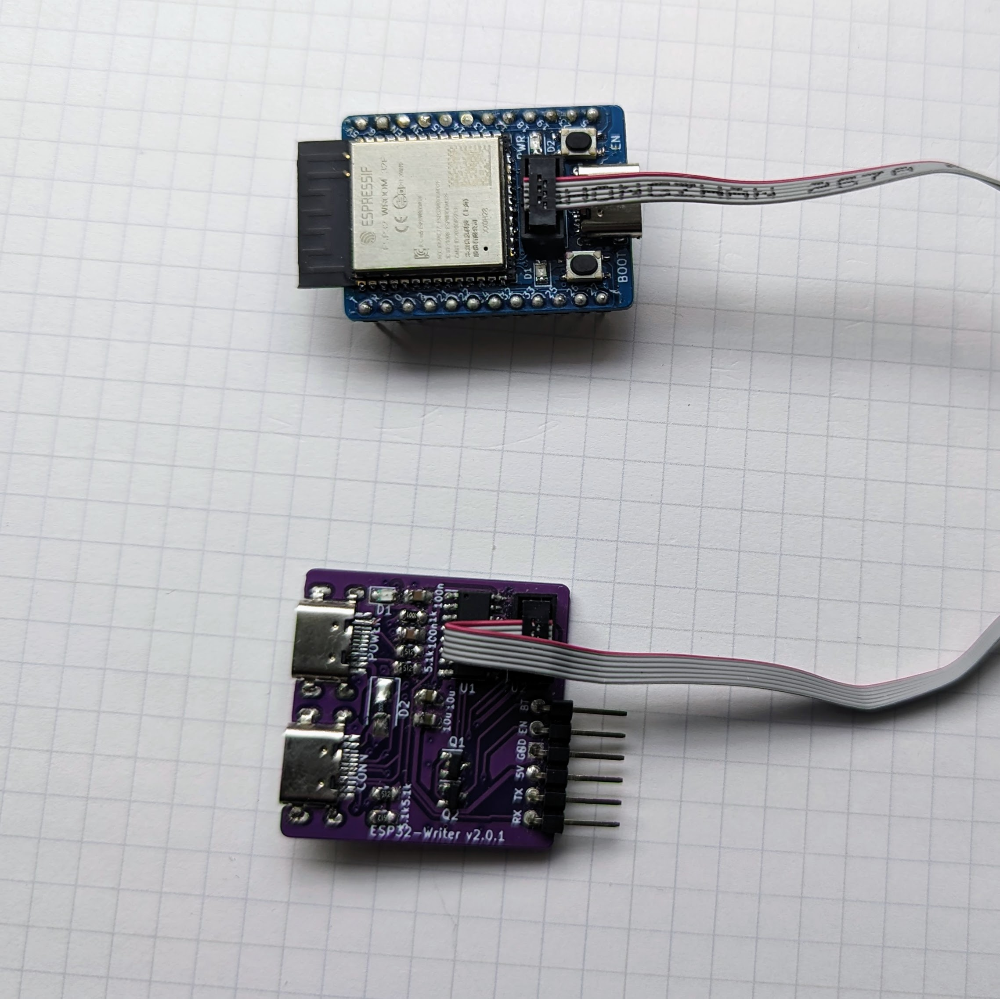
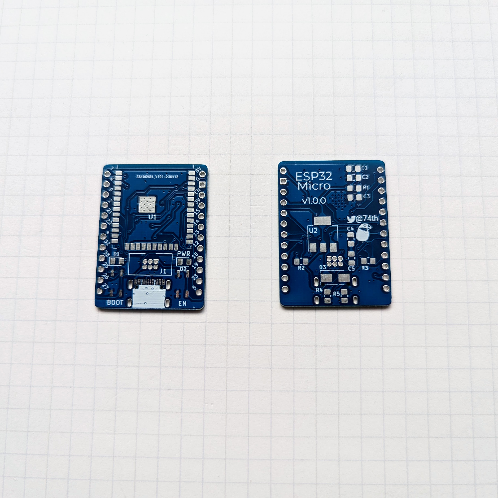

# ESP32 Micro

- やっぱり S3，C3 でもない素の ESP32 じゃないと動かないことが多いので、ESP32 を使いたい
- ProMicro のピン配置がわかりやすい

## v1.0.0

- semantics 回路図 [pdf](ESP32-WROOM-32-v1.0.0-pcb.pdf) [kicanvas](https://kicanvas.org/?github=https%3A%2F%2Fgithub.com%2F74th%2Fesp32-dev-boards%2Fblob%2Fesp32-wroom-32%2Fv1.0.0%2FESP32-WROOM-32%2FESP32-WROOM-32.kicad_sch)
- PCB [pdf](ESP32-WROOM-32-v1.0.0-semantics.pdf) [kicanvas](https://kicanvas.org/?github=https%3A%2F%2Fgithub.com%2F74th%2Fesp32-dev-boards%2Fblob%2Fesp32-wroom-32%2Fv1.0.0%2FESP32-WROOM-32%2FESP32-WROOM-32.kicad_pcb)

### Parts List 部品リスト

| id       | parts                                   | number |
| -------- | --------------------------------------- | ------ |
| U1       | ESP32-WROOM-32                          | 1      |
| U2       | SOT-223 3.3V Regulator AMS1117-3.3      | 1      |
| D1,D2    | 0805 LED PWR                            | 2      |
| D3       | SMA Diode                               | 1      |
| C1,C4    | 0805 capacitor 100n                     | 2      |
| C2,C5    | 0805 capacitor 10u                      | 2      |
| C3       | 0805 capacitor 1u                       | 1      |
| R1,R2,R3 | 0805 register 10k                       | 3      |
| R4,R5    | 0805 register 5.1k                      | 2      |
| J1       | ESP-Prog UART compatible box pin header | 1      |
| J2       | USB Type-C socket                       | 1      |
| SW1      | Push Switch BT                          | 1      |
| SW2      | Push Switch RST                         | 1      |
