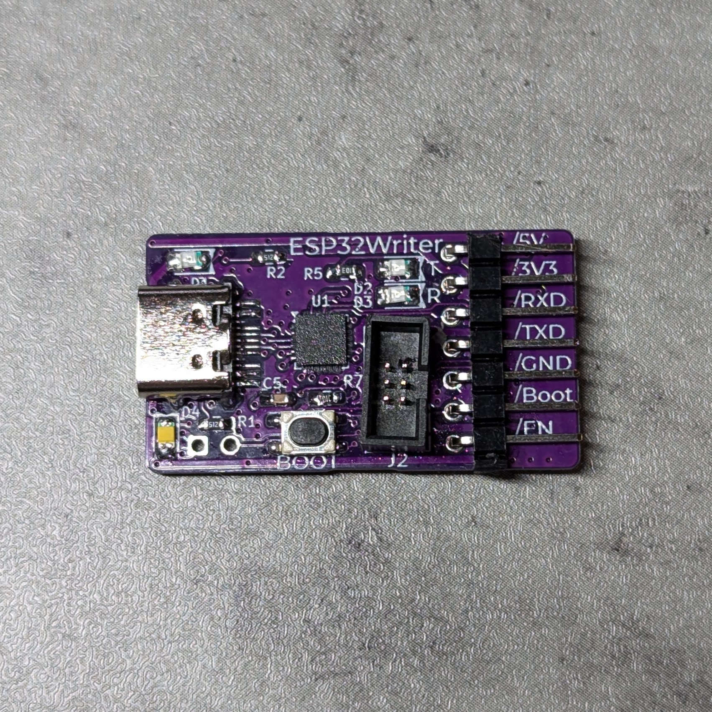
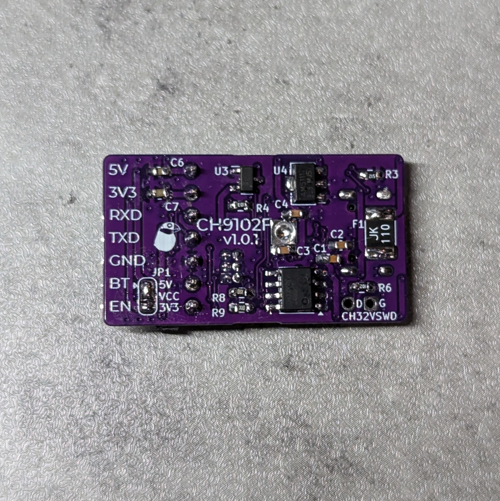
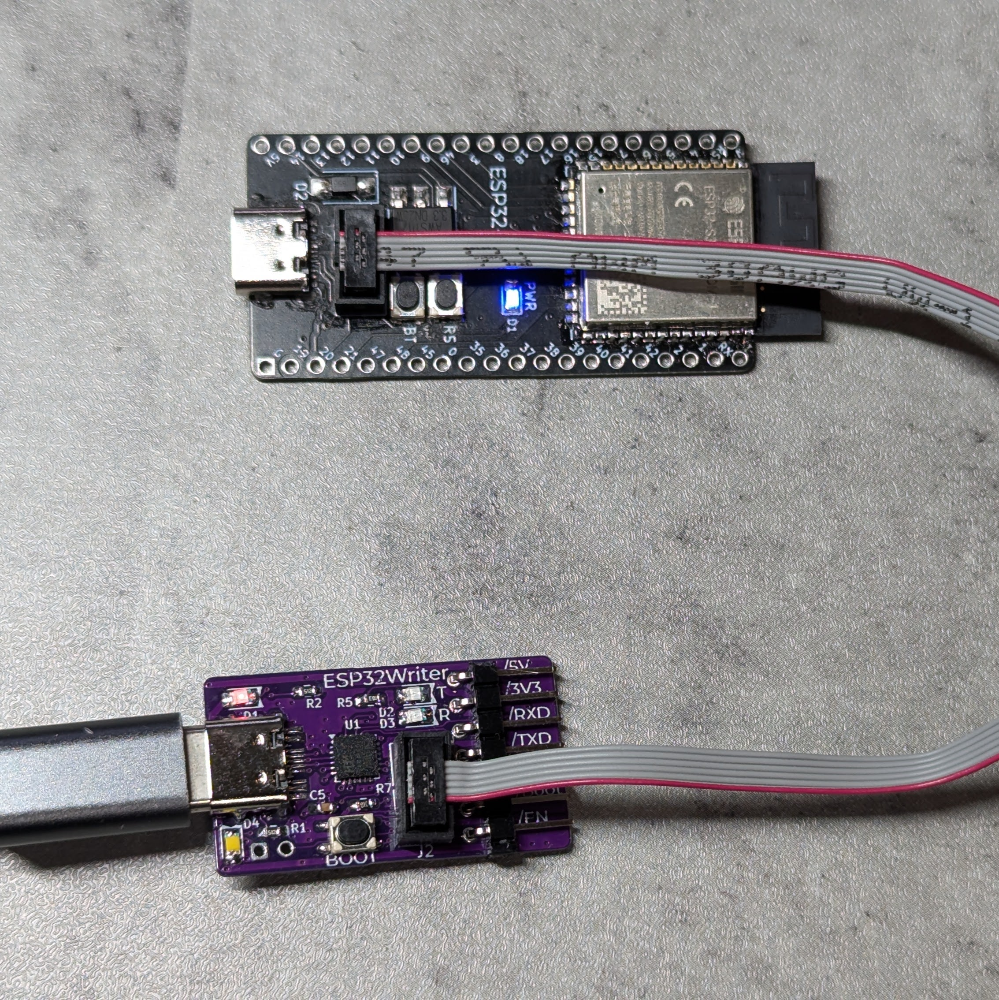
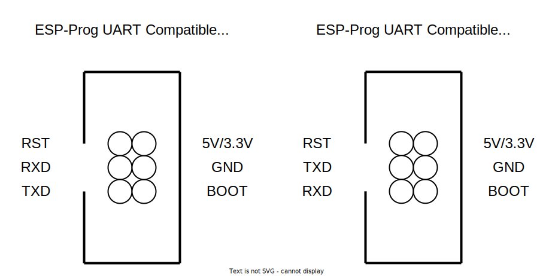

# ESP32 Write Pro CH9102F: ESP32 write tool with automatic download control using CH9102F

🇯🇵 ESP32 Write Pro CH9102F: CH9102F使用自動ダウンロード制御付きESP32書き込みツール

## features

- Uses WCH CH9102F
- Use CH32V003 for automatic download control and reliable timing control
- Switch to download mode with button
- ESP-Prog compatible with 1.24mm 2x3 box pin headers for ESP32 writing
- Solder jumper to switch between 3.3V or 5V supply voltage for ESP-Prog compatible ports

🇯🇵

- WCH CH9102Fを使用
- 自動ダウンロード制御に、CH32V003を使用して、確実なタイミングで制御する
- ボタンによるダウンロードモードへ切り替え
- ESP-Prog 互換ESP32書き込み用1.24mm 2x3ボックスピンヘッダ搭載
- はんだジャンパで、ESP-Prog互換ポートの電源電圧を、3.3Vまたは5Vに切り替え可能

## ESP-Prog Port Pinout / ESP-Progポートピンアサイン

## Mechanism for automatic download control / 自動ダウンロード制御の仕組み

The MCU reads the DTR and RTS pins of the CH9102F's UART and performs the following operations

- (1) DTR is operated from H to L (enters download boot)
  - BOOT pin: 0
  - Wait 100ms
  - EN pin: 0
  - Wait 100ms
  - EN pin: 1
  - 100-ms wait
  - BOOT pin: 1
- (2) RTS is operated from H to L (to reset)
  - EN pin: 0
  - 100ms wait
  - EN pin: 1

Using esptool.py, the device automatically enters download boot with operation (1) and is reset with operation (2) after writing.

Translated with DeepL.com (free version)

🇯🇵

CH9102FのUARTのDTR、RTSピンをMCUで読み取り、以下の操作をします。

- (1) DTRがH→Lに操作された（ダウンロードブートに入る）
  - BOOTピン: 0
  - 100ms待機
  - ENピン: 0
  - 100ms待機
  - ENピン: 1
  - 100ms待機
  - BOOTピン: 1
- (2) RTSがH→Lに操作された（リセットする）
  - ENピン: 0
  - 100ms待機
  - ENピン: 1

esptool.pyを使うと、(1)の動作で自動的にダウンロードブートに入り、書き込み後(2)の動作でリセットされます。

## Caution / 注意

VCC of the ESP-Prog port is initially set to 5 V. To switch to 3.3 V, switch the solder jumper.

🇯🇵

ESP-ProgポートのVCCは初期は5Vになっています。3.3Vに切り替える場合は、はんだジャンパを切り替えてください。

## v1.0.1

- Semantics/回路図 [PDF](./ESP-Writer-CH9102F-v1.0.1-semantics.pdf) [KiCanvas](https://kicanvas.org/?github=https%3A%2F%2Fgithub.com%2F74th%2Fesp32-dev-boards%2Fblob%2Fesp32-writer-ch9102f%2Fv1.0.1%2FESP32-Writer-CH9102F%2FESP-Writer-CH9102F.kicad_sch)
- PCB [KiCanvas](https://kicanvas.org/?github=https%3A%2F%2Fgithub.com%2F74th%2Fesp32-dev-boards%2Fblob%2Fesp32-writer-ch9102f%2Fv1.0.12FESP32-Writer-CH9102F%2FESP-Writer-CH9102F.kicad_pcb)

### BOM

| Reference | Name                              | Package         | Quantity |
| --------- | --------------------------------- | --------------- | -------- |
| C1-5      | Capacitor 100nF                   | SMD I0603 M1608 | 5        |
| C6-7      | Capacitor 10uF                    | SMD I0603 M1608 | 2        |
| D1        | LED RED                           | SMD I0805 M2012 | 1        |
| D2-3      | LED BLUE                          | SMD I0805 M2012 | 2        |
| D4        | LED YELLOW                        | SMD I0805 M2012 | 1        |
| F1        | PolyFuse 1812 KT6-1100SMDI        | I1206 M3216     | 1        |
| J1        | USB Type-C Receptacle             |                 | 1        |
| J2        | Box Pin Header 2x3 Pitch 1.27mm   |                 | 1        |
| JP1       | Jumper Jumper_3_Open              |                 | 1        |
| R1-3      | Register 5.1kΩ                    | SMD I0603 M1608 | 3        |
| R4-5,R7   | Register 10kΩ                     | SMD I0603 M1608 | 3        |
| R6        | Register 1kΩ                      | SMD I0603 M1608 | 1        |
| R8-9      | Register 10Ω                      | SMD I0603 M1608 | 2        |
| SW1       | Button SKRPABE010                 |                 | 1        |
| U1        | USB to Serial Port IC WCH CH9102F | QFN-24          | 1        |
| U2        | MCU WCH CH32V003J4M6              | SOIC-8          | 1        |
| U3        | USB Power Protection IC CH213K    | SOT-23          | 1        |
| U4        | Regulator 3.3V AMS1117-3.3        | SOT-89          | 1        |
