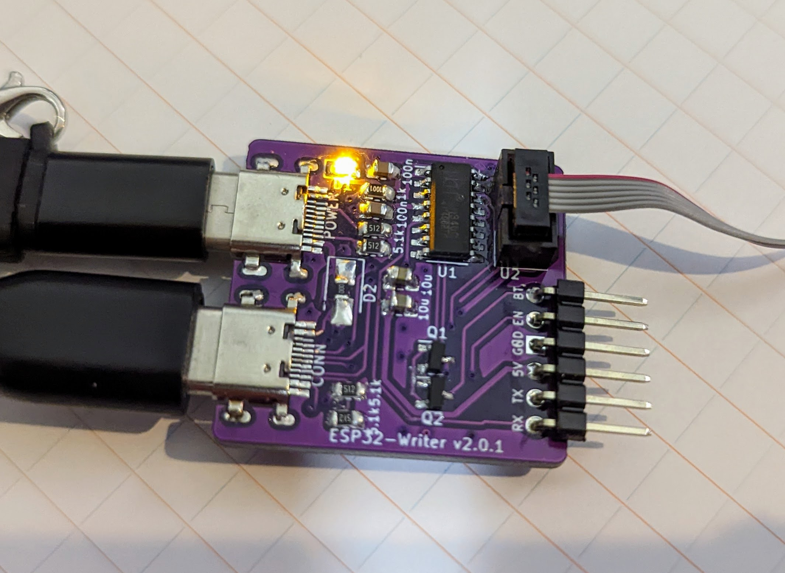

# CH340C 使用 ESP-Prog 互換 USB シリアル

ESP32 Writer として使える USB シリアル変換です。

- ESP32 の EN、GPIO0 用のピンを持ち、esptools を使ったアップロードで、EN、GPIO0 を自動で操作します。
- ESP32 のデバッグツールである ESP-Prog に付属する USB シリアル互換の、ボックスピンヘッダを持ちます。
- 電源用 USB と通信用 USB が別れています。これにより、電力の小さい PC の USB でも追加の電源用 USB で電源供給できます。

## なぜ ESP-Prog ではなくこれを作ったのか

- USB を、電源用と通信用の 2 つをもたせたいから。これがないと USB の給電能力が低い場合、PC で Write 後に、電源供給 USB への繋ぎ変えが必要になり面倒くさい。

## なぜ市販の USB シリアル変換アダプタではなくこれを作ったのか

- EN、BOOT を操作する必要がないようにしたいから。

## v2.0.1 ~ 2.0.2

### 部品表

| ID  | 指定子      | 名称                                      | 数量 |
| --- | ----------- | ----------------------------------------- | ---- |
| 1   | C1,C4       | 0805 キャパシタ 10u                       | 2    |
| 2   | J1,J3       | USB 2.0 Type-C ソケット                   | 2    |
| 3   | R4,R1,R2,R5 | 0805 レジスタ 5.1k                        | 4    |
| 4   | Q2,Q1       | MOSFET SN7002                             | 2    |
| 5   | C2,C3       | 0805 キャパシタ 100n                      | 2    |
| 6   | D1          | 0805 LED                                  | 1    |
| 7   | D2          | ショットキーダイオード 340mV@1A PMEG2010ER       | 1    |
| 8   | U2          | ESP-Prog 互換 1.27 ボックスピンヘッダ 2x3 | 1    |
| 9   | U1          | USB シリアル IC CH340C                    | 1    |
| 10  | J2          | UART ピンヘッダ                           | 1    |
| 11  | R3          | 0805 レジスタ 1k                          | 1    |

- ダイオードの電圧低下が大きい場合、ダイオードの代わりに 0R レジスタを入れることもできます（製作者はそれで使っています）

[部品の調達先はこちらを確認下さい ../parts.md](../parts.md)

### ドキュメント

- [Semantics v2.0.1 = 2.0.2](ESP32-writer-2.0.1-semantics.pdf)
- [PCB v2.0.1](ESP32-writer-2.0.1-pcb.pdf)

## 変更履歴

- v2.1.0
  - CH340G に変更（ESP-Writer-CH340G として、別プロダクトへ変更）
- v2.0.2
  - USB Type-C ソケットのフットプリントを実装しやすいものに変更
- v2.0.1
  - 配線ミスを修正
- v2.0.0
  - ESP-Prog 互換 Box Pin Header を追加
