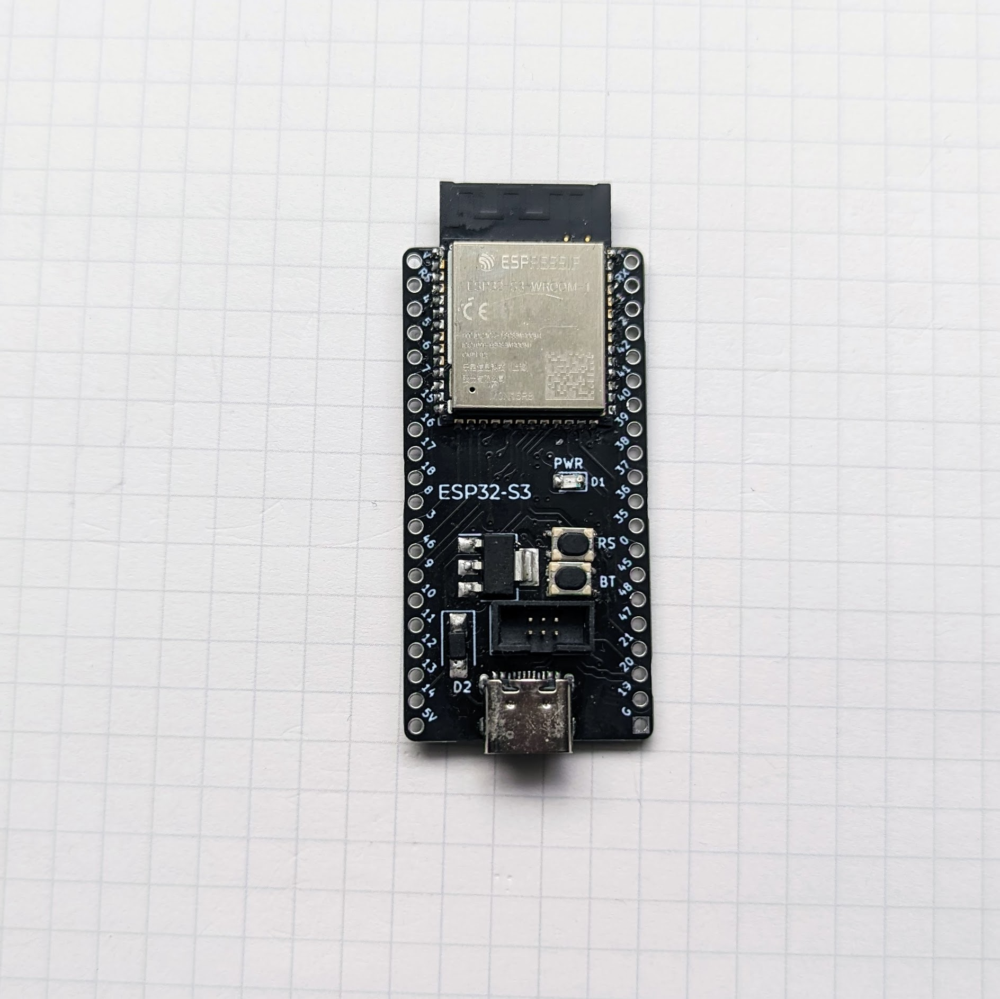
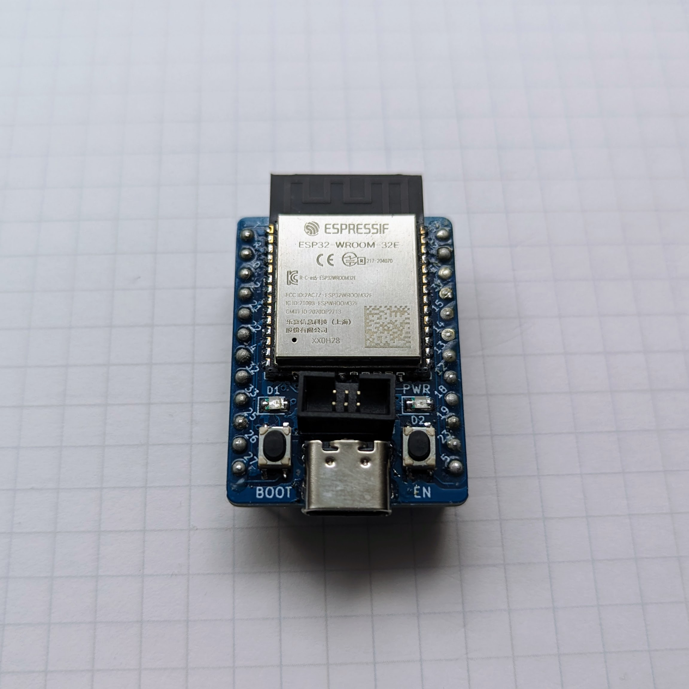

# ESP32 Dev Boards

   

- [ESP32-Writer](ESP32-writer): ESP-Prog 互換ボックスピンヘッダをもつ CH340C を使った ESP32 Writer
- [ESP32-S3-DevBoard](ESP32-S3-WROOM-1): ESP32-S3-WROOM-1 用の開発ボード
- [ESP32-C3-DevBoard](ESP32-C3-WROOM-02): ESP32-C3-WROOM-02 用の開発ボード
- [ESP32-C3-DevBoardM](ESP32-C3-MINI-1): ESP32-C3-MINI-1 用の開発ボード
- [ESP32-DevBoard](ESP32-WROOM-32): ESP32-WROOM-32 用の開発ボード

## 利用している外部リソース

- https://github.com/espressif/kicad-libraries

## License

MIT License

公開している基板データは自由に利用可能です。販売はご遠慮いただけると助かります。
